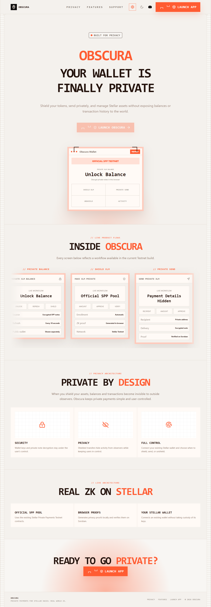
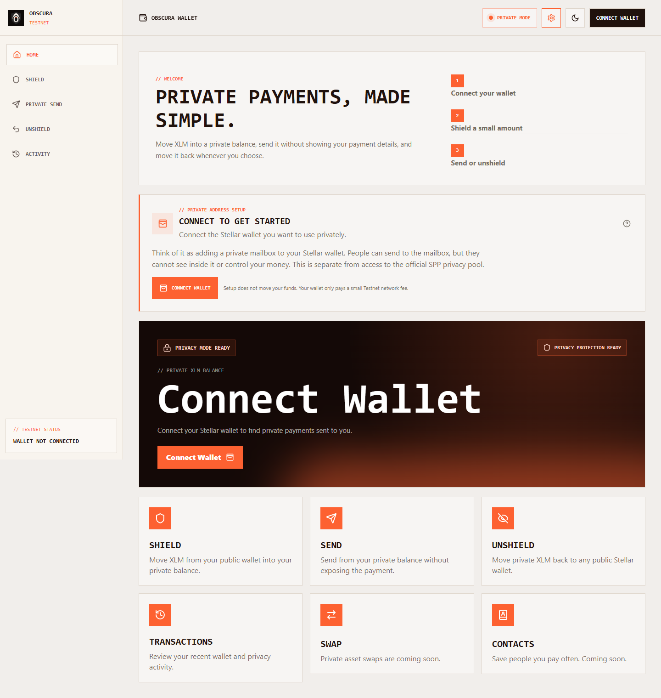

# Obscura

**Private payments on Stellar, powered by the official Stellar Private Payments reference implementation.**

Obscura is a Testnet wallet interface for shielding XLM, sending private XLM,
and returning private funds to a public Stellar address. It connects to an
existing wallet and never asks for a secret key.

> Obscura and Stellar Private Payments are experimental, unaudited Testnet
> software. Use small Testnet amounts only.

## Screenshots





## What Works

- Connect an existing Stellar Testnet wallet
- Read the connected account's live public XLM balance
- Create private note and encryption keys locally with a wallet signature
- Register a wallet for private receiving
- Enroll automatically in the SPP membership tree when the deployed contract
  permits user enrollment
- Shield XLM through the official SPP pool
- Generate Groth16 proofs in a browser web worker
- Submit and verify proofs through Soroban
- Send private XLM to another registered address
- Unshield private XLM to a Stellar public address
- Read the local private-note portfolio
- Switch between responsive light and dark themes

## How It Works

1. **Connect:** Obscura connects through Stellar Wallets Kit. The supported
   wallet picker only shows wallets that can sign transactions, messages, and
   Soroban authorization entries required by SPP.
2. **Create private keys:** The wallet signs a fixed key-derivation message.
   SPP derives private note keys locally. Secret keys and private notes stay in
   browser storage.
3. **Register:** Obscura publishes the public note and encryption keys so
   another user can address a private payment to the wallet. This is similar to
   adding a private mailbox address.
4. **Shield:** XLM is converted exactly to stroops, a private note commitment
   is created, and a Groth16 proof is generated locally.
5. **Verify:** The wallet signs the Soroban request. The SPP pool calls its
   verifier contract and accepts the commitment only when the proof is valid.
6. **Send or unshield:** Spending a private note creates another fresh proof.
   A private send creates encrypted notes for the recipient; unshielding sends
   XLM back to a public Stellar address.

Public wallet balances and private-note balances are different. A recipient
will not see a private payment in the normal public XLM balance. They connect
the registered wallet to Obscura and unlock the private balance with a message
signature.

## Official Testnet Contracts

| Contract | Address |
| --- | --- |
| XLM pool | `CBUEFW2J5QZ6Q2ARZWQPFWF4T7DRXCZWDTM34WNM375Y56FE4DSL42S2` |
| Groth16 verifier | `CBKOZTEYI5RAGSUKWAQEC4V6MRYDC4KL2D3PRPKMLWHTMXMFSCBVUJXX` |
| Membership | `CAMMKUKPKTR73DGBD5CLYXWDUYI6DP2EKUREW6O3L65EAZMF6GXJRMPK` |
| Public key registry | `CBBWNJ75EQDPQWJJDZ2WHMJWPLDYDQUCTL2V6F23VG3JAL3PEYZSNL4S` |

See [SPP integration notes](docs/SPP_INTEGRATION.md) for the complete flow and
upstream artifact provenance.

## Local Setup

Requirements:

- Node.js 20 or newer
- npm
- A funded Stellar Testnet account
- Freighter, Hana, Klever, OneKey, or Cactus Link

```bash
git clone https://github.com/Datwebguy/Obscura.git
cd Obscura
npm install
copy .env.example .env.local
npm run dev
```

Open `http://localhost:3000`.

The checked-in defaults use the official SPP Testnet contracts, so copying the
environment file is optional for local development. Set
`NEXT_PUBLIC_SPP_BOOTNODE_URL` when operating a compatible SPP indexer or
bootnode; it improves recovery beyond the public RPC event-retention window.

## Environment Variables

| Variable | Purpose |
| --- | --- |
| `NEXT_PUBLIC_STELLAR_HORIZON_URL` | Public Stellar account and balance API |
| `NEXT_PUBLIC_STELLAR_RPC_URL` | Soroban Testnet RPC endpoint |
| `NEXT_PUBLIC_SPP_XLM_POOL_ID` | SPP XLM privacy pool |
| `NEXT_PUBLIC_SPP_VERIFIER_ID` | Groth16 verifier contract |
| `NEXT_PUBLIC_SPP_ASP_MEMBERSHIP_ID` | SPP membership contract |
| `NEXT_PUBLIC_SPP_BOOTNODE_URL` | Optional compatible SPP history service |

## Commands

```bash
npm run dev
npm run lint
npx tsc --noEmit
npm run build
npm start
```

## Deploying to Vercel

1. Import `Datwebguy/Obscura` into Vercel.
2. Keep the framework preset on **Next.js**.
3. Add any environment overrides from `.env.example`.
4. Deploy.

No server-held wallet secrets or custom backend are required. The SPP browser
artifacts are served from `public/js`; private proof generation runs in the
user's browser.

## Tech Stack

- Next.js 15 App Router and TypeScript
- React 19
- Stellar SDK and Stellar Wallets Kit
- Nethermind Stellar Private Payments browser/WASM artifacts
- Soroban smart contracts and Groth16 proofs
- Framer Motion and Lucide icons

## Upstream and Licensing

The SPP browser artifacts come from
[Nethermind's Stellar Private Payments](https://github.com/NethermindEth/stellar-private-payments)
at revision `10352700afb56861bf3e67b1bf62a628300c2c45`. Their source reference,
license, and notices are included in [`public/spp-legal`](public/spp-legal).
Obscura does not claim that the upstream protocol is audited or production
ready.
